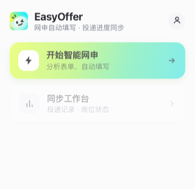
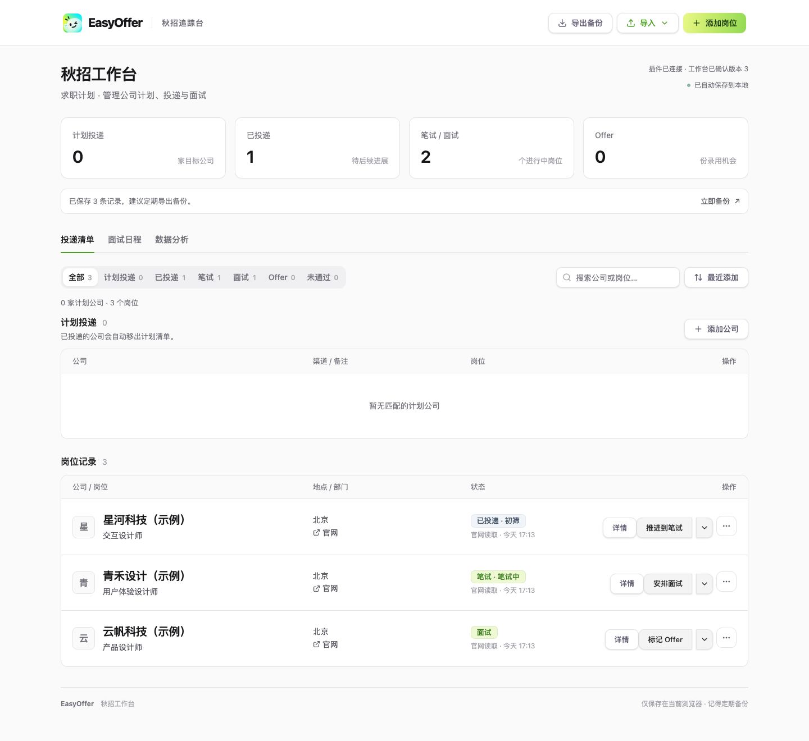

  
  <h1>EasyOffer</h1>
  
<strong>少填重复简历，清楚掌握每一次投递。</strong>

  
AI 网申填写助手 + 求职投递工作台 · Chrome / Edge 扩展

  

    <a href="https://github.com/Linyouju/EasyOffer/releases/download/v5.0.3/easyoffer-extension.zip"><strong>⬇ 下载插件</strong></a> ·
    <a href="#安装">安装教程</a> ·
    <a href="docs/USAGE.md">使用指南</a> ·
    <a href="https://github.com/Linyouju/EasyOffer/releases/tag/v5.0.3">版本更新</a> ·
    <a href="https://github.com/Linyouju/EasyOffer/issues">反馈问题</a>
  

## 这是什么？

每换一家公司的招聘网站，就要重新填一次教育、实习和项目经历；投递多了，还要记住哪家在笔试、哪家等面试。

**EasyOffer 帮你复用一份个人资料，辅助填写网申，并把岗位和投递进度集中到一个工作台。**

| 填简历 | 记投递 | 看进度 |
| --- | --- | --- |
| 理解网页字段，优先填写资料库原文 | 从岗位页、投递记录页读取信息 | 按公司查看状态，一键打开官网 |
| 需要限字或拆分时，AI 适配已有内容 | 同步岗位与官网当前状态 | 更新笔试、面试、Offer 等进度 |

## 界面预览

**浏览器里开始填写，工作台里跟进投递。**

*以上为实际界面，工作台使用虚构的示例记录。*

## 安装

**准备：Chrome 或 Edge 浏览器；使用 AI 功能需要自己的模型 API Key。**

1. **[下载插件 ZIP](https://github.com/Linyouju/EasyOffer/releases/download/v5.0.3/easyoffer-extension.zip)**，解压得到 `extension` 文件夹。
2. 在浏览器地址栏输入 `chrome://extensions`（Edge 输入 `edge://extensions`），打开 **开发者模式**。
3. 点击 **加载已解压的扩展程序**，选择 `extension` 文件夹。安装完成！

点击浏览器工具栏的扩展图标，将 **EasyOffer** 固定，之后就能随时打开。

## 开始使用

1. **准备资料**：点击插件右上角的人像图标，录入经历，或导入 Excel / 简历文件。
2. **连接 AI**：在设置页填写模型服务地址、模型名称和 API Key，测试连接。
3. **填写网申**：打开公司的简历编辑页，点击 **开始智能网申**；填完核对后保存、提交。
4. **跟进投递**：打开岗位或投递记录页，点击 **同步工作台**，再到 **秋招工作台** 查看进度。

[查看详细使用指南 →](docs/USAGE.md)

## 当前版本 · 5.0.3 测试版

官网入口直接可点；投递状态可灵活切换；操作后支持 **8 秒撤销**；显示状态来源与最近官网检查时间。

[查看更新说明与下载文件 →](https://github.com/Linyouju/EasyOffer/releases/tag/v5.0.3)

## 了解更多

[更新与备份](docs/USAGE.md#更新与备份) · [数据与权限](PRIVACY.md) · [源码构建](docs/DEVELOPMENT.md) · [问题反馈](https://github.com/Linyouju/EasyOffer/issues)

资料保存在本地浏览器；AI 使用你配置的模型服务，费用按服务商规则计收。开启自动检查后，访问招聘页面时同步状态。

[MIT 许可证](LICENSE) · [第三方声明](THIRD_PARTY_NOTICES.md)
