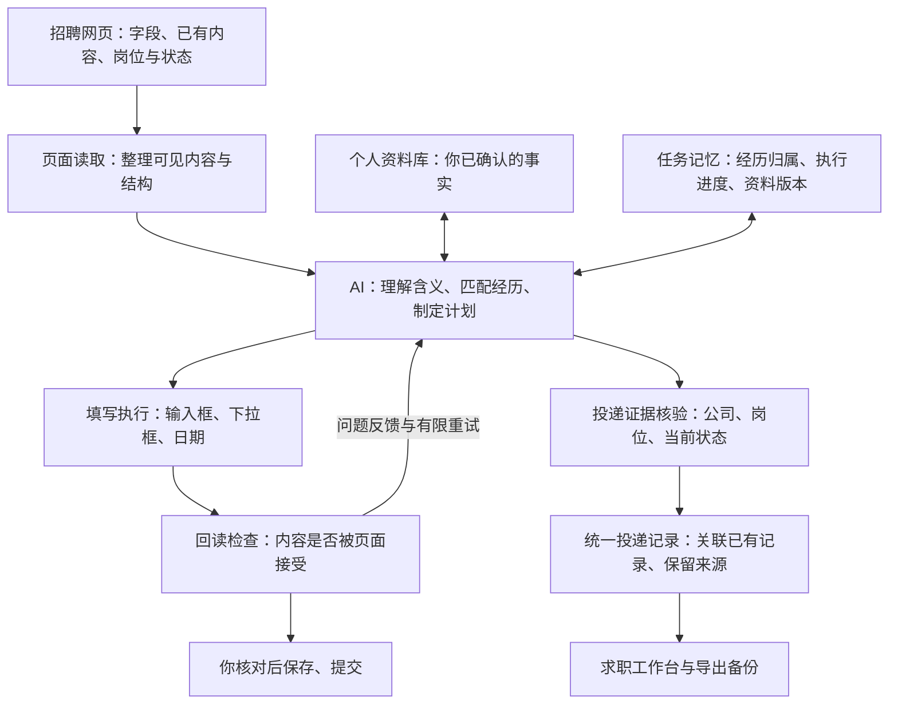

# EasyOffer 的 AI 怎样工作？

[← 项目首页](../README.md) · [按步骤开始使用](USAGE.md)

**AI 负责理解和规划；插件负责执行和检查；个人资料库提供事实；工作台记录投递进度。**

## 一张图看懂整体架构

填写和投递识别共用页面读取、模型调用及任务记忆。工作台操作与官网同步也使用同一套投递记录，避免各自维护不同的进度。

## AI 会怎样处理你的内容？

| 网页情况 | EasyOffer 的处理方式 |
| --- | --- |
| 「项目描述」改叫「实践内容」 | 判断含义与经历归属，优先使用资料库原文 |
| 一段描述拆成背景、职责、成果 | 从已有事实提取对应部分 |
| 300 字内容只能填 100 字 | 基于原文压缩，保留关键事实 |
| 日期拆成年、月两个下拉框 | 按控件要求转换日期格式，逐项操作并检查 |
| 资料里没有可支撑的成果信息 | 标记缺失，交给用户补充 |
| 官网显示笔试、面试等阶段 | 识别当前状态及对应岗位，核验页面证据后同步 |

这里的“匹配”主要指**网页字段与履历事实的匹配、岗位记录与已有投递的关联**。当前不提供针对目标岗位的适配度评分或录用概率预测。

## 与固定字段映射有什么不同？

下面比较两种处理方式，便于理解 EasyOffer 的设计。具体产品可能同时采用多种方式，不能把牛客、Offline 或其他助手统一视作纯规则工具。

| 处理环节 | 仅采用固定字段映射时 | EasyOffer 的做法 |
| --- | --- | --- |
| 字段换了问法 | 依靠预设名称或别名找到对应字段 | AI 结合上下文解释含义，再匹配资料 |
| 一段经历拆成多个问题 | 需要预先准备每个目标字段 | 按需要从已有事实提取、组合或压缩 |
| 页面已有部分内容 | 依赖填写策略决定跳过或覆盖 | 结合已有内容确认经历归属，保护非空内容并尝试续填 |
| 判断是否填好 | 取决于实现是否检查执行结果 | 回读内容，失败反馈用于有限重试或重新规划 |
| 投递进度 | 需要对应的记录与状态识别能力 | 共享 AI 理解流程，核验证据后更新统一投递记录 |

控件规则依然有用：AI 判断“填什么、填到哪段经历”，执行模块解决“怎样点选、怎样输入、是否成功”。两者协作，目标是减少漏填、错配和反复手动处理。

目前没有与其他产品的同条件完整率、成功率对比测试，因此不展示未经测量的排名或领先百分比。

## “有记忆”是什么意思？

插件会保存任务中的经历归属、填写进度和可复用的适配内容。继续任务时，会结合当前页面和资料版本，复用仍有效的记录。

这是**任务记忆与内容复用**，并非在后台训练一个不断变强的模型。更新资料后，相关旧计划会重新检查；新增不相关资料不需要让全部旧信息失效。

## 数据保存在哪里？

- **个人资料**：在插件的资料管理页维护，保存在本地浏览器；Excel 用于导入与导出。
- **AI 服务**：使用你配置的模型，理解页面和完成必要内容适配时发送相关信息。
- **投递记录**：统一保存在本地，工作台和导出使用同一份记录。
- **官网状态**：访问相关网页时读取，并显示来源和最近检查时间。
- **推送提醒**：飞书等渠道属于后续规划，目前尚未内置。

[查看数据与权限说明](../PRIVACY.md)

## 想继续看代码？

| 模块 | 源码入口 |
| --- | --- |
| 页面读取 | [page-observer.js](../integrations/openjobtracker/v2/page-observer.js) |
| AI 规划与事实核验 | [semantic-planner.js](../integrations/openjobtracker/v2/semantic-planner.js) |
| 统一模型调用 | [model-gateway.js](../integrations/openjobtracker/v2/model-gateway.js) |
| 填写、回读与续填 | [form-adapter.js](../integrations/openjobtracker/v2/form-adapter.js) |
| 个人资料模型 | [profile-core.js](../integrations/openjobtracker/v2/profile-core.js) |
| 投递身份与状态 | [application-core.js](../integrations/openjobtracker/v2/application-core.js) |

[从源码构建](DEVELOPMENT.md)
