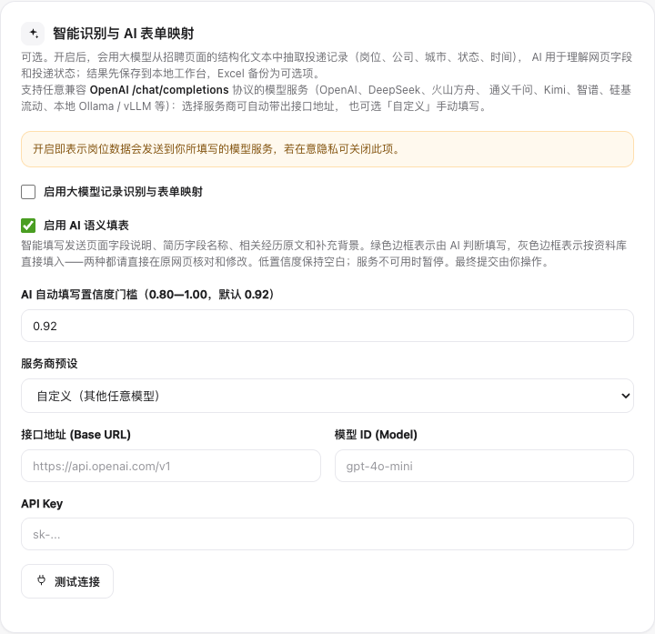
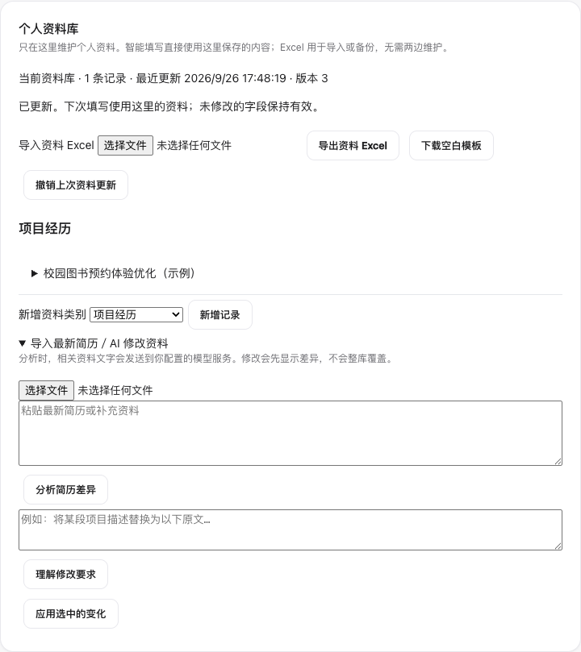

# EasyOffer 使用指南

[← 项目首页](../README.md) · [AI 怎样工作](HOW_IT_WORKS.md)

**第一次：安装 → 配置 AI → 准备资料。之后：打开网申 → 智能填写 → 核对提交 → 同步工作台。**

## 1. 安装插件

1. [下载正式版](https://github.com/Linyouju/EasyOffer/releases/latest)，在 **Assets** 中选择 **easyoffer-extension.zip**，解压得到 `extension` 文件夹。
2. 地址栏输入 `chrome://extensions`（Edge 用 `edge://extensions`），开启 **开发者模式**。
3. 点击 **加载已解压的扩展程序**，选择 `extension` 文件夹。
4. 在浏览器工具栏的扩展菜单中固定 EasyOffer，方便随时打开。

安装好后，你会看到下面三个入口。**右上角人像图标**打开资料和设置。

## 2. 连接你的 AI 模型

点击右上角人像图标，在设置页找到 **智能识别与 AI 表单映射**。

1. 勾选 **启用大模型记录识别与表单映射**、**启用 AI 语义填表**。
2. 选择服务商，按服务商提供的信息填写下面三项。
3. 点击页面底部的 **保存设置**，再点击 **测试连接**，确认测试通过。

| 设置项 | 填什么 |
| --- | --- |
| 接口地址（Base URL） | 模型服务提供的 API 地址；选择预设会带出对应地址 |
| 模型 ID（Model） | 你要调用的模型名称，以服务商提供的 ID 为准 |
| API Key | 在模型服务商处创建的密钥 |

模型调用使用你自己的服务账号，费用按服务商规则计收。暂时没有模型配置时，也可以先手动整理个人资料。

## 3. 建立个人资料库

在同一设置页的 **个人资料库** 中选择一种录入方式：

| 你手上的资料 | 怎样录入 |
| --- | --- |
| 已有简历 | 展开 **导入最新简历／AI 修改资料**，选择 PDF / DOCX / TXT 文件，或粘贴文字 → **分析简历差异** → 核对并勾选 → **应用选中的变化** |
| 已有资料 Excel | **导入资料 Excel** → 核对差异 → **应用选中的变化**；需要格式示例时先下载空白模板 |
| 想直接填写 | 选择 **新增资料类别** → **新增记录** → 展开记录填写 → **保存这条记录** |

*截图使用虚构项目，不包含真实个人信息。*

展开经历后，检查日期、描述和各字段的确认状态。已有完整描述可设为 **原样填写**；允许基于事实调整的内容可选择 **可基于事实整理**。

**以后在这里维护资料即可。** 插件从保存后的资料库读取信息；Excel 是导入、导出工具，不需要两边同时编辑。扫描版 PDF 需先转为可读取的文字。

## 4. 在招聘网站填写网申

1. 登录招聘网站，进入简历的**可编辑页面**。如果正在看简历预览，先打开相应的编辑区域。
2. 打开 EasyOffer，点击 **开始智能网申**。
3. AI 分析页面并匹配资料，页面内的助手显示进度和待补充项。
4. 按提示补充缺少的信息，点击 **继续填写**。需要中断时用 **停止**；需要回退时用 **撤销本页填写**。
5. 核对经历、日期和描述，在招聘网站自行保存、提交。

例如：网站把「项目描述」叫作「实践内容」，AI 会理解两者的关系，使用你已有的描述。如果网站拆成「背景 / 本人职责 / 成果」，则从已有事实中提取对应内容；资料里没有成果事实，就留给你补充。

如果公司、岗位和时间已经填好，描述仍为空，插件会在确定对应经历后尝试补齐。页面已有内容会受到保护。

## 5. 同步岗位和投递进度

**打开官网岗位详情页或投递记录页 → 点击「同步工作台」→ 查看同步结果 → 打开「秋招工作台」。**

岗位详情页用于读取岗位信息；投递记录页用于读取你的实际投递状态。只打开岗位详情，不代表已经投递。

AI 从页面读取岗位、公司和当前状态，系统关联已有记录后更新。同一条投递再次同步，会继续更新原记录。若提示未完成，可按提示补充或重试。

## 6. 在工作台跟进

| 想做什么 | 在哪里操作 |
| --- | --- |
| 查看某家公司 | 搜索公司或岗位，或按已投递、笔试、面试等状态筛选 |
| 回到招聘网站 | 点击记录中的 **↗ 官网** |
| 查看内部详情 | 点击 **详情** |
| 手动改进度 | 点击状态主按钮，或旁边的下拉菜单选择面试、未通过、放弃等操作 |
| 撤销刚才的状态操作 | 在提示出现后的 **8 秒内**点击撤销 |
| 看状态新不新 | 查看 **官网读取**或**手动更新**及相应时间 |
| 保存一份记录副本 | 使用导出备份入口 |

后续再次打开官网投递记录页，可以重新同步。开启自动检查时，访问相关招聘页面会触发读取；关闭网站期间不会后台巡检。

## 更新与备份

更新前导出资料和投递记录备份。下载新版扩展 ZIP，将文件替换到原安装目录，再到浏览器扩展管理页点击 EasyOffer 的 **重新加载**。

资料和投递记录保存在自己的浏览器中。AI 功能会将所需内容发送到你配置的模型服务。卸载扩展或清理浏览器数据前，请先导出备份。[查看数据与权限说明](../PRIVACY.md)

### 让 Agent 协助更新

把下面这段话与项目链接交给 WorkBuddy、Codex 或 Claude Code：

> 请帮我更新 EasyOffer：https://github.com/Linyouju/EasyOffer 。先确认我的安装目录、当前版本和是否有自行修改，引导我导出资料与投递记录备份。如果使用发布包，检查最新正式版并更新原安装目录；如果是自行修改的源码，先保留本地改动再处理更新。最后引导我重新加载扩展，核对版本和资料是否正常。

## 遇到问题

到 [Issues](https://github.com/Linyouju/EasyOffer/issues) 描述：使用的浏览器、EasyOffer 版本、出现问题的页面类型，以及预期和实际结果。截图请遮住联系方式等个人信息，保留字段名称和错误提示即可。

